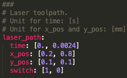
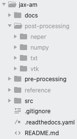

Frequently Asked Questions (FAQ)
================================

Q: What are the dependencies of this code?
------------------------------------------

You need to install `JAX <https://github.com/google/jax>`_. We highly encourage you to create a ``conda`` environment and install all Python packages in the environment. Although JAX works with CPU, GPU is usually 10-100 times faster.

Another major tool we use is `Neper <https://neper.info/>`_ for polycrystal structure generation. Neper is a CPU intensive software.  

Q: What are the units used in the simulation?
---------------------------------------------

We use SI units for all quantities except for length, which is in [mm].

Q: How do I run an example?
---------------------------

We use `module run <https://stackoverflow.com/questions/7610001/what-is-the-purpose-of-the-m-switch>`_ to execute a certain script. For instance, to run  ``src/example.py``, under ``jax-am/`` and specify in command line the following

>>> python -m src.example 

Q: How do I specify laser path?
-------------------------------

All input parameters including laser path are now included in the YAML file (``jax-am/pre-processing/default.yaml``). For example, in the yaml file we have

This means that we turn the laser on at t=0 [s], x=0.2 [mm], y=0.1 [mm], then turn the laser off at t=0.0024 [s], x=0.8, [mm], y=0.1 [mm]. In between those time stamps, laser is assumed to travel with a constant speed.

Please also check :ref:`prep` for more information.

Q: I got an error of "certain directory does not exist".
--------------------------------------------------------

Just create a directory manually. We didn't track the data folder on GitHub, so you would have to create the data folder by yourself on your local machine. For example, what appears on my local machine is 

As you can see, we sort the data files according to their types. We will make this part more user-friendly in the future.
