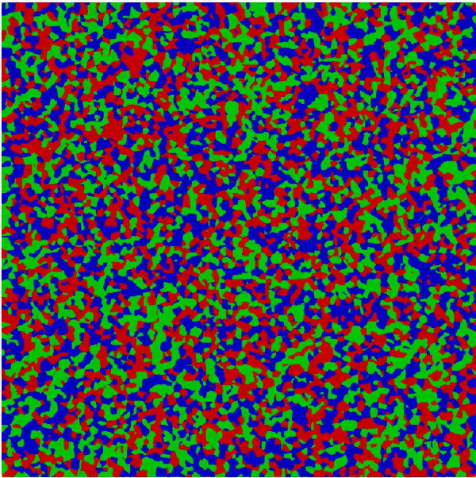
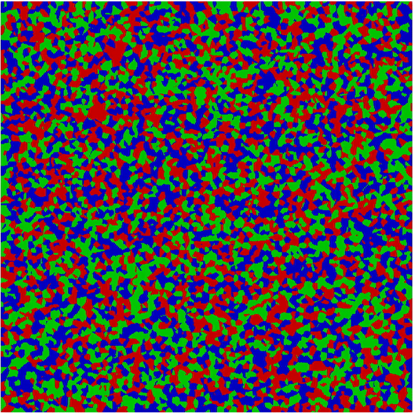

Gallery
=======

Directional Solidification
--------------------------

Competitive grain growth is observed if grain anisotropy is considered. Left is when grain anisotropy is NOT included, and right is when it is included. Competitiveness: red > blue > green for anisotropic case. 

|pic1| |pic2|

More to come!
-------------
 