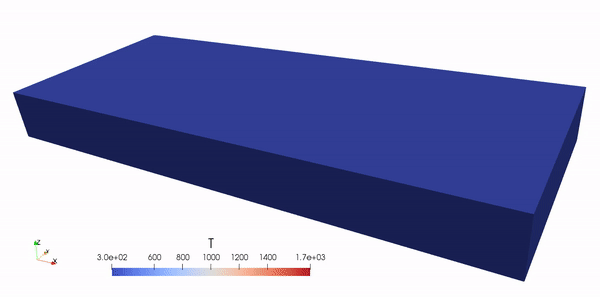
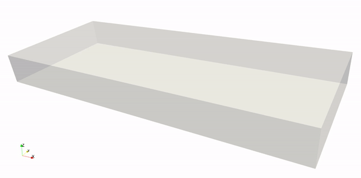
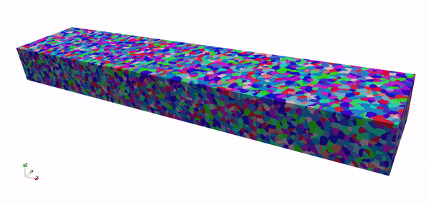

.. jax-am documentation master file, created by
   sphinx-quickstart on Thu Jun 30 11:08:35 2022.
   You can adapt this file completely to your liking, but it should at least
   contain the root `toctree` directive.

Welcome to JAX-AM's documentation!
==================================

**JAX-AM** is a Python library for numerical simulations in additive manufacturing.

.. note::

   This project is under active development.

Solving Problems in Additive Manufacturing
------------------------------------------

  Temperature field

  Melt pool

  Microstructure

Simulating Explict Dynamics with JAX
------------------------------------

We use `JAX <https://github.com/google/jax>`_ for implementation of the computationally intensive part. The polycrystal structure is generated with `Neper <https://neper.info/>`_. 

Why JAX? We believe JAX is an exciting tool for scientific simulations.  

1. The code is in Python, and it runs on **CPU/GPU** with high performance.
2. It is natural for research of **AI for science/engineering**, because JAX is intended for machine learning research.
3. The automatic differentiation feature of JAX is useful for **design and optimization**.

Contents
--------

.. toctree::
   :maxdepth: 1
   :caption: Contents:

   quick_start
   equations
   pre-processing
   post-processing
   gallery
   FAQ
   api
   about
   usage

Indices and tables
==================

* :ref:`genindex`
* :ref:`modindex`

.. * :ref:`search`
